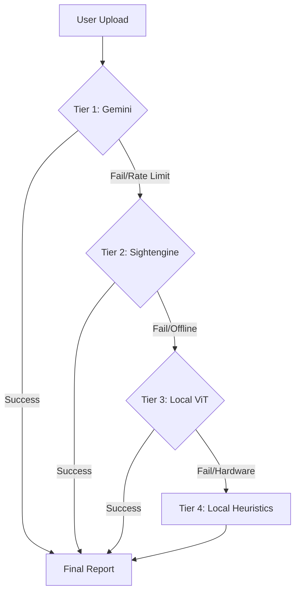

# 🛡️ TruthLens AI

<div align="center">


**The Ultimate Multi-Agent Deepfake Detection Shield**

[](https://react.dev)
[](https://nodejs.org)
[](https://firebase.google.com)
[](https://deepmind.google/gemini)
[](https://python.org)

> 🔍 **TruthLens AI** is a privacy-first, enterprise-grade platform that identifies deepfakes using a sophisticated 4-tier forensic pipeline.

[Explore Features](#-key-features) • [Architecture](#-4-tier-forensic-pipeline) • [Setup Guide](#-getting-started) • [Security](#-security--privacy)

</div>

---

## ✨ Key Features

### 🤖 Multi-Agent AI Reasoning
Unlike simple classifiers, TruthLens uses **4 specialized agents** that collaborate to reach a verdict:
- **Perception Agent**: Detects visual artifacts, blending errors, and lighting mismatches.
- **Authenticity Agent**: Cross-references anomalies against known deepfake generation patterns.
- **Reasoning Agent**: Analyzes temporal inconsistencies across video frame sequences.
- **Confidence Agent**: Synthesizes all data into a final probability score and explainable report.

### 🛡️ 4-Tier Forensic Pipeline
Ensures 99% uptime and high accuracy through a layered defense strategy:
1. **Tier 1 (Gemini VLM)**: Primary multimodal reasoning (high depth).
2. **Tier 2 (Sightengine)**: Specialized forensic API (~90% accuracy).
3. **Tier 3 (Local ViT)**: SigLIP-based local Transformer model (~85% accuracy).
4. **Tier 4 (Local Heuristics)**: OpenCV, FFT frequency analysis, and biological signal checks.

### 🔒 Privacy-First Architecture
- **In-Memory Processing**: Media files are processed as RAM buffers and never written to disk.
- **Zero-Storage Policy**: No user media is persisted; only the final text report is saved.
- **Secure Auth**: Firebase-powered OTP authentication ensures only authorized access.

---

## 🧠 4-Tier Forensic Pipeline

TruthLens is designed to function even when external APIs are unavailable or limits are reached.



---

---

## ⚡ Performance Optimizations

TruthLens AI is optimized for speed and accuracy:
- **Low-Latency Auth**: Parallelized Firebase/Firestore lookups for near-instant login and profile management.
- **Fast Analysis**: Optimized frame extraction and concurrent VLM processing for rapid results.
- **Unlimited Usage**: No daily scan limits – analyze as many photos and videos as needed.

---

## ⚙️ Getting Started

### 1. Prerequisites
- **Node.js** v18+ & **npm** v9+
- **Python** v3.9+ (for local forensic tiers)
- **FFmpeg** installed on your system PATH

### 2. Installation

```bash
# Clone the repository
git clone https://github.com/P-Arpita0205/TruthLens-AI.git
cd TruthLens-AI

# Install Node dependencies
cd backend && npm install
cd ../frontend && npm install

# Install Python dependencies (for Tier 3/4)
cd ..
pip install -r requirements.txt
```

### 3. Environment Configuration

Create a `.env` file in the `/backend` directory:

```env
PORT=5000
GEMINI_API_KEY=your_key
SIGHTENGINE_API_USER=your_user
SIGHTENGINE_API_SECRET=your_secret
SMTP_USER=your_gmail
SMTP_PASS=your_app_password
```

> **Note**: Place your `serviceAccountKey.json` in `backend/src/config/`.

### 4. Running the App

```bash
# Terminal 1: Backend
cd backend && npm run dev

# Terminal 2: Frontend
cd frontend && npm run dev
```

---

## 🛠️ Tech Stack

<details>
<summary><b>Frontend (Client)</b></summary>

- **React 19** & **Vite**
- **Tailwind CSS** (Styling)
- **Framer Motion** (Animations)
- **Recharts** (Data Viz)
- **Lucide** (Icons)
</details>

<details>
<summary><b>Backend (Server)</b></summary>

- **Node.js** & **Express**
- **Firebase Admin SDK** (Auth & Firestore)
- **Google Gemini SDK** (AI reasoning)
- **Hugging Face Transformers** (Local ViT)
- **OpenCV & PyTorch** (Forensics)
- **fluent-ffmpeg** (In-memory extraction)
</details>

---

## 🔐 Security & Privacy

- **No Media Persistence**: Frames exist only in volatile RAM buffers.
- **Secure Sessions**: HTTP-only cookies and JWT-based authentication.
- **Git Protection**: All secrets (`.env`, `serviceAccountKey.json`) are strictly excluded via `.gitignore`.
- **Atomic Quotas**: Prevents race conditions in scan limits.

---

## 📄 License

TruthLens AI is open-source software licensed under the **ISC License**.

---

<div align="center">

Made by [P Arpita](https://github.com/P-Arpita0205)

**[TruthLens AI](https://github.com/P-Arpita0205/TruthLens-AI) — Restoring trust in digital media.**

</div>
