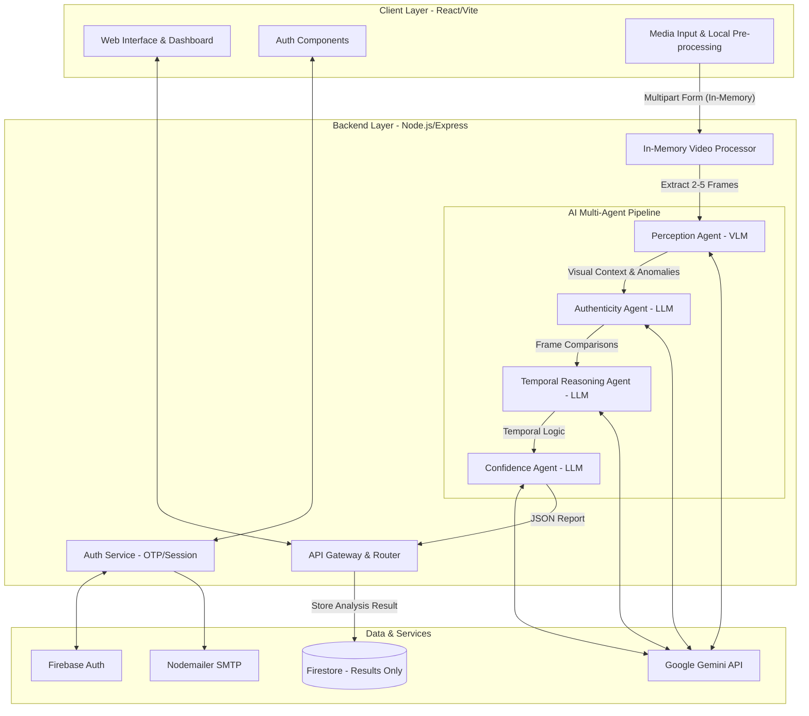

# TruthLens AI Architecture Design

This document outlines the production-ready, privacy-first architecture for TruthLens AI. It employs a modern tech stack (React + Node.js) integrated with Gemini's Multimodal capabilities to detect deepfakes via a Multi-Agent reasoning pipeline.

## 1. High-Level Architecture Diagram



## 2. Data Flow (Step-by-Step)

### Authentication Flow
1. **Email/Password**: User signs up. Backend creates user via Firebase Admin.
2. **2FA Trigger**: Backend generates OTP, stores hash in memory/Redis, sends via Nodemailer (Email) or Firebase (Phone).
3. **Verification**: User submits OTP. Backend validates and issues secure, HTTP-only JWT session cookie.

### Video Analysis & Privacy-First Flow
1. **Upload Initiation**: User selects a video. The frontend uploads it directly to the backend API via memory stream. (No disk storage).
2. **Frame Extraction**: The backend uses an in-memory `ffmpeg` buffer to extract 2–5 keyframes from the video stream.
3. **Multi-Agent Pipeline (Memory Only)**:
   - **Perception Agent**: Passes the extracted frames to Gemini VLM (`gemini-1.5-pro` or `gemini-1.5-flash`). It is prompted to detect visual artifacts, unnatural lighting, and blending errors in each frame.
   - **Authenticity Agent**: Analyzes the perception output against known deepfake generation artifacts.
   - **Reasoning Agent**: Looks at the outputs across the temporal sequence (Frame 1 vs Frame 3 vs Frame 5) to identify temporal inconsistencies (e.g., flickering, unnatural physics).
   - **Confidence Agent**: Aggregates all agent findings, calculates a final authenticity score, and generates a structured, explainable JSON report.
4. **Data Destruction**: The backend explicitly drops the video buffer and image frames from memory. **Garbage collection cleans the media. It is never written to disk or cloud storage.**
5. **Storage**: The resulting JSON report (score, agent explanations, metadata) is saved to Firestore.
6. **Dashboard**: Frontend fetches the text/graphical analytics from Firestore. No media is shown.

## 3. API Flow

```text
POST /api/v1/analyze/video
├── Headers: { Authorization: Bearer <token> }
├── Body: multipart/form-data (video stream)
│
├── Middleware: Validate Token -> Check Rate Limits
├── Controller: MediaProcessor
│   ├── Extract frames to Buffer[]
│   ├── Init Agent Pipeline:
│   │   ├── perceptionAgent(Buffer[]) -> base64 -> Gemini VLM -> text anomalies
│   │   ├── authenticityAgent(anomalies) -> Gemini LLM -> verified patterns
│   │   ├── reasoningAgent(patterns) -> Gemini LLM -> temporal logic
│   │   └── confidenceAgent(logic) -> Gemini LLM -> { score: 85, reason: "..." }
│   ├── Flush memory buffers
│   └── Save to Firestore (docId: hash(timestamp+userId))
│
└── Response: 200 OK
    {
       "analysisId": "xyz123",
       "score": 85,
       "verdict": "Likely Manipulated",
       "explanation": "Temporal inconsistency detected in facial lighting between frames 2 and 4."
    }
```

## 4. Recommended Folder Structure

```text
truthlens-ai/
├── client/                     # React / Vite
│   ├── src/
│   │   ├── assets/             # Global styles, tailwind configs
│   │   ├── components/         # Reusable UI (Cards, Charts, Nav)
│   │   ├── pages/              # Dashboard, Auth, Analyzer Pages
│   │   ├── hooks/              # Custom hooks (useAuth, useAnalysis)
│   │   ├── services/           # Axios API clients
│   │   └── store/              # State management (Zustand/Context)
│   ├── package.json
│   └── vite.config.js
│
└── server/                     # Node.js / Express
    ├── src/
    │   ├── api/
    │   │   ├── controllers/    # Route logic (auth, analyze)
    │   │   ├── middlewares/    # Auth guards, multer memory config
    │   │   └── routes/         # Express router definitions
    │   ├── ai/                 # Multi-Agent System
    │   │   ├── agents/         # Perception, Authenticity, Reasoning, Confidence
    │   │   └── gemini/         # Gemini API wrappers & prompt templates
    │   ├── config/             # Env vars, Firebase admin setup
    │   ├── services/           # Nodemailer, Video frame extraction logic
    │   └── utils/              # Memory management, helpers
    ├── package.json
    └── server.js
```

## 5. Layer Responsibilities

### Frontend (React/Vite)
- **UI/UX**: Render premium, highly-responsive dynamic interfaces (charts, tables).
- **Client-Side Simulation**: Pre-validate file sizes and formats before sending.
- **Session Management**: Handle route protection based on authentication state.
- **Data Visualization**: Translate complex AI JSON output into easy-to-read gauges and graphs.

### Backend (Node.js/Express)
- **Gatekeeper**: Manage secure sessions, validate Firebase tokens, enforce rate-limiting.
- **Orchestrator**: Coordinate the flow between the uploaded memory stream and the AI Multi-Agent pipeline.
- **Data Processor**: Efficiently handle buffer streams. Crucially responsible for enforcing the **No-Storage** privacy policy.
- **Database Client**: Interface with Firestore to securely log analytics without media payloads.

### AI System (Gemini VLM & LLM)
- **Perception**: "Eyes" of the system. Ingests raw frame buffers directly via Gemini Multimodal API.
- **Cognition**: The internal LLM agents (Authenticity, Reasoning) act as the "Brain", breaking down complex verification into specific analytical steps.
- **Synthesis**: The Confidence agent structures the final output into a deterministic JSON format for frontend consumption.
